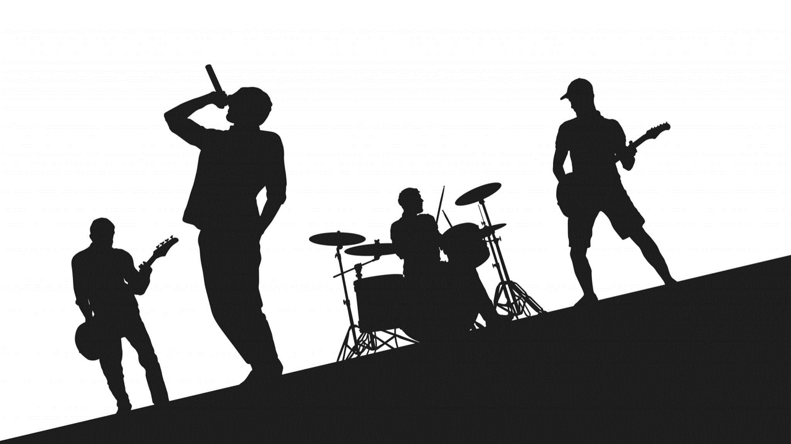
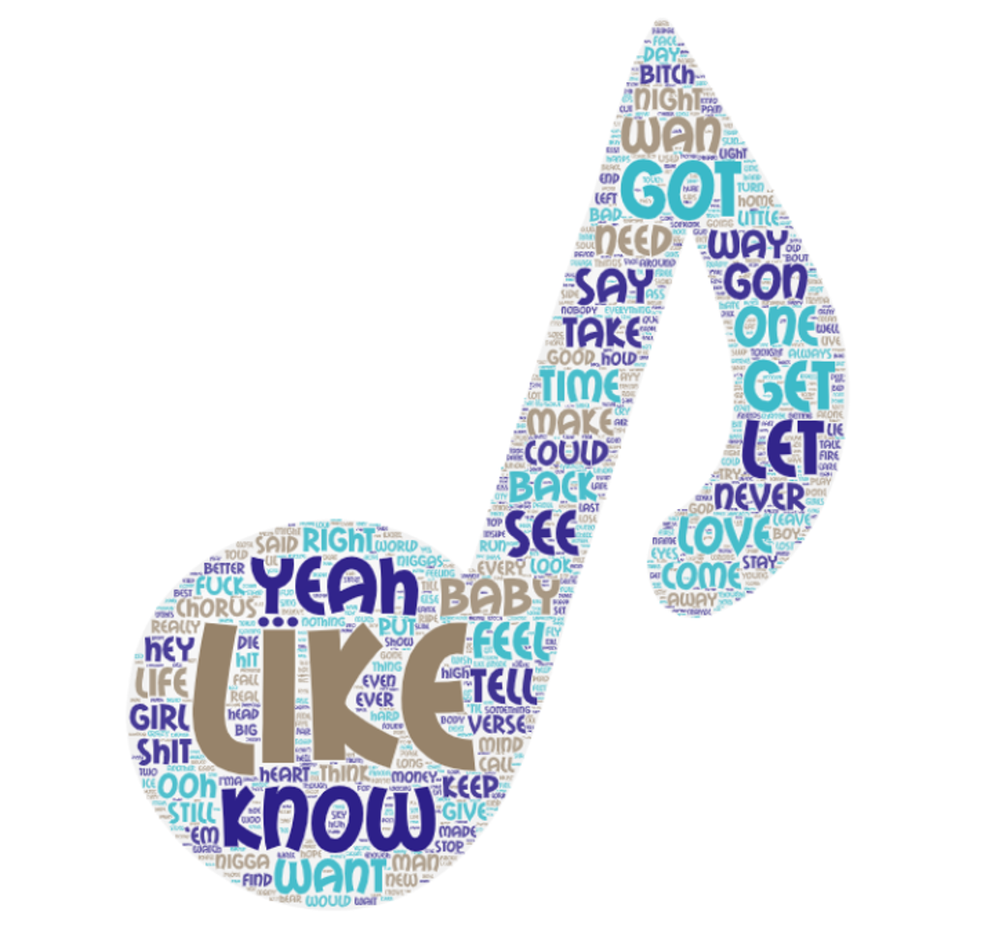
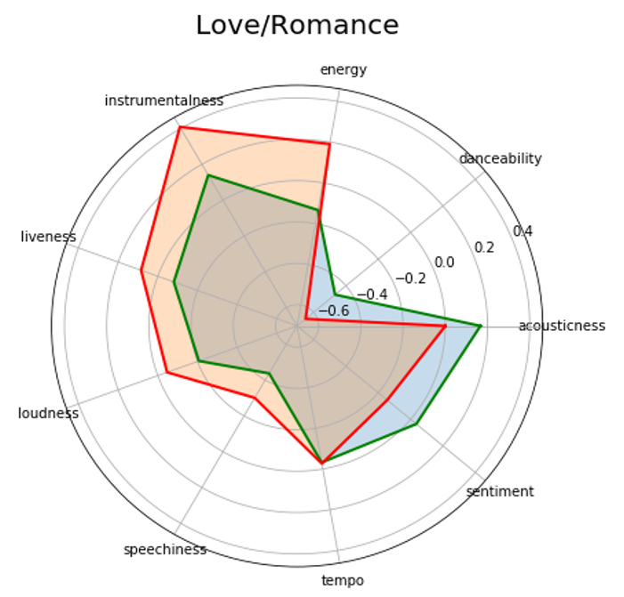
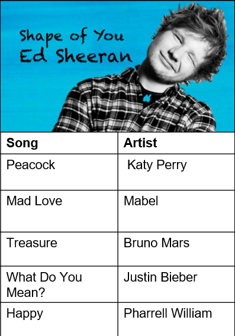

# Recipes-for-a-chart-buster and Song Recommendations
Business purviews: 
  Predicition of a chart buster based on lyrics and elements of music in a song
  Recommend right ingredients for a chart buster
  Content based song recommendations
  
We have used Spotify for songs, last.fm for listener count and Genius for lyrics.
Web scraping, Topic Modeling, Sentiment Analysis, Regression and Classification for recommendations have been used

# Introduction
This project was doen for the Text Analytics coursework under the guidance of [Prof. Anitesh Barua](https://www.mccombs.utexas.edu/Directory/Profiles/Barua-Anitesh) 
The aim of this project was to combine our text analytics and modeling skills to develop a product that could:

1) Predict if a song would become a hit based on its lyrics and musical features 
2)	Suggest the right ingredients for a banger hit 
3)	Perform content based song recommendation

# Data Overview
•	We chose a set of 3,000 tracks the recent decade and extracted features like acousticness, danceability and tempo from Spotify API 
•	LastFM API was leveraged to get the listener count for every track 
•	Lyrics were scraped for all these tracks from Fandom and Genius using Beautiful Soup

# Approach
•	Data pre-processing on the lyrics and create a Tf-idf vector 
•	Classified the songs into 4 different categories using topic modelling (Latent Dirichlet Allocation) 
•	Logistic regression to classify the song as a hit/flop based on the listener count 
•	Build a recommendation engine for songs using the topics and the song features (Cosine similarity)
#### Word cloud of the lyrics

# Results
#### The right ingredient for a love/romance song

#### Sample recommendation based on lyrics

